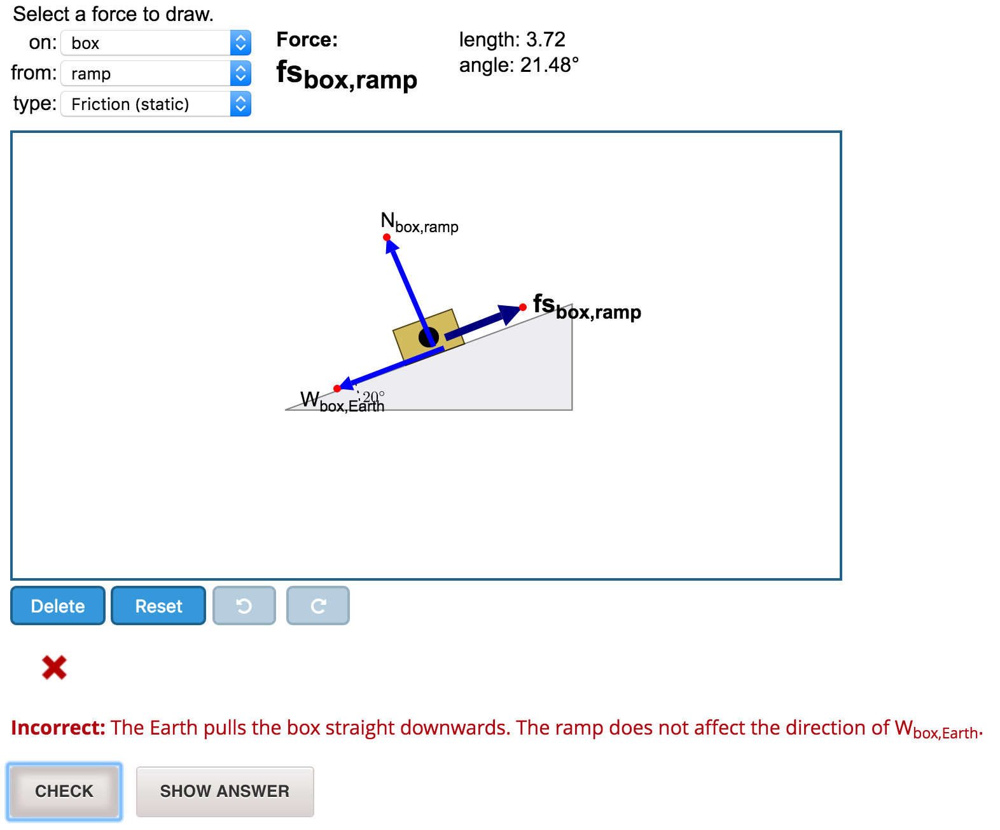

# jsinput-freebodydraw
Free-body drawing exercises with JSInput. A modification of the [jsinput-vectordraw](https://github.com/open-craft/jsinput-vectordraw) project from DavidsonNext and OpenCraft.



<!-- START doctoc generated TOC please keep comment here to allow auto update -->
<!-- DON'T EDIT THIS SECTION, INSTEAD RE-RUN doctoc TO UPDATE -->
**Table of Contents**

- [Major Changes from jsinput-vectordraw](#major-changes-from-jsinput-vectordraw)
- [Installation](#installation)
  - [Problem Definition](#problem-definition)
    - [forceDescriptors and vectors](#forcedescriptors-and-vectors)
  - [Grading](#grading)
    - [expected_result](#expected_result)
    - [Feedback Messages](#feedback-messages)
    - [Presence Checks](#presence-checks)
    - [cusotm_checks](#cusotm_checks)
    - [Grading Order](#grading-order)
- [Acknowledgements](#acknowledgements)

<!-- END doctoc generated TOC please keep comment here to allow auto update -->

## Major Changes from jsinput-vectordraw

1. UI: use three dropdowns (type, on, from) to select which force vector to draw
2. UI: menu is horizontal layout
3. UI: vector dropdown always matches vector properties
4. UI: selected vector is darker, thicker 
5. UI: active/inactive status for "delete", "redo", "undo" buttons
6. UI: remove "add vector" button
7. Touchscreen: improved dragging and drawing on touchscreens
8. Setup: use `forceDescriptors` to automatically generate a the list of drawable vectors
9. Grading: first check that everything drawn so far is correct (and `presence:false` for unexpected vectors)
10. Grading: some new check functions, e.g., `min_length` and `angle_not`
11. Grading: customized feedback messages for
    1. Nothing drawn
    2. Negligible graviational forces
    3. Normal forces drawn not normal to surface
    4. Friction forces drawn not parallel to surface
    5. Static friction pointing opposite direction
    6. Kinetic friction pointing opposite direction
12. Examples: use [cfn_tools](https://github.com/ChristopherChudzicki/cfn_tools) to pretty-format error messages

## Installation

* Upload `python_lib.zip`, `freebodydraw.js` and `freebodydraw.css` to the *Files* section in the Studio.
* Choose one of the problems from the `Notes_and_Examples` directory, for example `stacked_blocks_pulley_FBD`.
* Upload `stacked_blocks_pulley_FBD.html`, `stacked_blocks_pulley_FBD.svg`, and `stacked_blocks_pulley_setup.svg` files to the *Files* section in the Studio.
* Add a new *Blank Advanced Problem* component to a unit in the Studio.
* Paste `stacked_blocks_pulley_FBD.xml` content into the advanced editor, save, and publish.

##Reference

### Problem Definition

To create a free-body drawing exercise, you will need to create a new HTML file
with some boilerplate and the problem definition. You can base the
HTML file on `api-example.html` located in the root folder of this
repository.

The problem is defined in the `freebodydraw_settings` object. It
supports these properties:

* `width`: The width of the board in pixels (defaults to `550`).
* `height`: The height of the board in pixels (defaults to `400`).
* `bounding_box_size`: Controls the scale of the coordinate system on the board. The vertical axis will run from a lower limit of `ymin = - bounding_box_size` to an upper limit of `ymax = bounding_box_size`. (Defaults to `10`.)
* `background`: Should be an objects containing:
    * `src`, for example `stacked_blocks_pulley_FBD.svg` (path relative to location of HTML file)
    * `width`: The width **in board coordinate units** to which the background image should be stretched. 
* `forceDescriptors`: An object that specifies all the forces a user can draw. More info below.
* `expected_result`: The expected state of vectors after the user successfully solves the problem. The data given here is used for grading. More info below.
* `custom_checks`: An array of custom checks used for grading. This is needed when the grading is more complex and can't be defined in terms of `expected_result` only. More info below.
* `axis`: Show the graph axis (defaults to `false`).
* `show_navigation`: Show navigation arrows and zooom controls (defaults to `false`).
* `show_vector_properties`: Show the vector properties box (defaults to `true`).

#### forceDescriptors and vectors
In Davidson's original [jsinput-vectordraw](https://github.com/open-craft/jsinput-vectordraw) project, problem authors specify a list of `vectors` that the user can draw.

In `jsinput-freebodydraw`, a `vectors` object still exists but should never be accessed directly by the problem author. Instead, the author specifies a `forceDescriptors` object that is used to generate a list of vectors.

The `forceDescriptors` is an array of three objects that describe (1) the types of forces, (2) what objects the forces act on, and (3) what objects exert forces. For example:
```
var forceDescriptors = [
    {
        label:"type", //do not change the label 
        shortNames:["T","N","W","f"],
        longNames:["Tension","Normal","Gravitational","Friction"]
    },
    {
        label:"on", //do not change the label 
        shortNames:["1","2"],
        longNames:["Box 1", "Box 2"]
    },
    {
        label:"by", //do not change the label 
        shortNames:["1","2","rope","table","Earth"],
        longNames:["Box 1","Box 2","rope","table","Earth"]
    }
];
```
The `shortNames` are used when naming vectors and labeling the drawing; `longNames` are used in dropdowns and feedback messages. 

Users are able to draw one vector for every possible combination of `<type>_<on>_<from>`. For example, the `forceDescriptors` above would allow users to draw vectors with 

```
"T_1_2"         "N_1_2"         "W_1_2"         "f_1_2"
"T_1_rope"      "N_1_rope"      "W_1_rope"      "f_1_rope"
"T_1_table"     "N_1_table"     "W_1_table"     "f_1_table"
"T_1_Earth"     "N_1_Earth"     "W_1_Earth"     "f_1_Earth"
                                                
"T_2_1"         "N_2_1"         "W_2_1"         "f_2_1"
"T_2_rope"      "N_2_rope"      "W_2_rope"      "f_2_rope"
"T_2_table"     "N_2_table"     "W_2_table"     "f_2_table"
"T_2_Earth"     "N_2_Earth"     "W_2_Earth"     "f_2_Earth"
```
These vector names are used for grading purposes.

### Grading
#### expected_result

The `expected_result` setting defines vector properties for
grading. Vectors omitted from the `expected_result` are required to be undrawn during grading. These are the supported properties:

1. `min_length`: Expected minimum length (a small value of `min_length` is added by default for all vectors that should be drawn).
2. `tail`: Expected coordinates of the tail position, for example `[0, 1.5]`.
3. `tail_x`, `tail_y`: Use these instead of `tail` when you are only interested in one of the coordinates, but not both.
4. `tip`: Expected coordinates of the tip position.
5. `tip_x`, `tip_y`: Use these instead of `tip` when you are only interested in one of the coordinates, but not both.
6. `coords`: Combines `tail`, `tip`, `tail_x`, and `tail_y` as a single rule.
7. `length`: The expected length of the vector.
8. `angle_not`: An angle value the vector is expected NOT to have. (*Useful for providing customized feedback*)
9. `angle`: The expected vector angle.

Every property is optional - you can check an arbitray list of properties for each vector.

Each property check is performed with some default tolerance. You can specify a custom tolerance for each check by specifying a `<property>_tolerance` entry. For example, if you wanted to check the angle of vector `W_1_Earth` is within 4 degrees of 270 degrees, you would specify:

```
    expected_result: {
        W_1_Earth: {angle: 270, angle_tolerance: 4}
    }
```

The `tail_tolerance` and `tip_tolerance` define the maximum allowed
distance of the vector tail/tip from the point specified by the
coordinates.

#### Feedback Messages
Each property check comes with a default error message that can be
overriden by specifying a `<property>_errmsg` entry. For example, you could use:

```
    expected_result: {
        W_1_Earth: {angle: 270, angle_tolerance: 4, angle_errmsg: "Your force {label} has the wrong direction. The gravitational force on Block 1 should point straight downward."}
    }
```
Above, `{label}` is a standard python `format`
placeholders that will be replaced by the vector's label. Placeholders may be used for these vector properties: `name`, `label`, `forceType`, `forceOn`, `forceFrom`, `tail_x`, `tail_y`, `tip_x`, `tip_y`, `length`, `angle`. 

**Special Default Messages for Specific Force Types** Forces whose `type.longName` property contains `"gravitational"`, `"friction"`, `"normal"`, "`static`", or `"kinetic"` have specialized, physics-related default error messages for some checks.

#### Presence Checks
There is one additional builtin check not listed above: `presence`, which can take value `true` (to check presence) or `false` (to check absence).

* `presence:false` is automatically chcecked for all vectors that **are not** listed within `expected_results`
* `presence:true` is automatically checked for all vectors that **are** listed in `expected_results`

You can also use `presence:true` or `presence:false` in expected results to override the default error messages.

#### cusotm_checks

The `custom_checks` property can be useful for more complex checks
that can't be specified using the `expected_result` entry alone.
When using custom checks, the pyton grading code for each custom check
needs to be defined in the problem XML. See [jsinput-vectordraw](https://github.com/open-craft/jsinput-vectordraw) for details.

#### Grading Order
The grading philosophy for `freebodydraw` is to first checking that everything drawn so far is correct, then check whether anything is missing. In particular, the check order is:

1. Check that the user has not drawn anything that should not be drawn. (I.e., `presence:false` is checked for all vectors not listed in `expected_results`)
2. Perform all checks listed within `expected_results` for vectors that have already been drawn.
 * Individual checks are performed in the order listed above. E.g., `min_length` is checked first and `angle_not` is checked before `angle`.
3. Check whether any vectors in expected_results have not been drawn yet. (I.e., check `presence:true` for all undrawn vectors in `expected_results`.)


## Acknowledgements

This project is heavily based on [jsinput-vectordraw](https://github.com/open-craft/jsinput-vectordraw) by OpenCraft and Davidson Next.

Table of contents *generated with [DocToc](https://github.com/thlorenz/doctoc)*